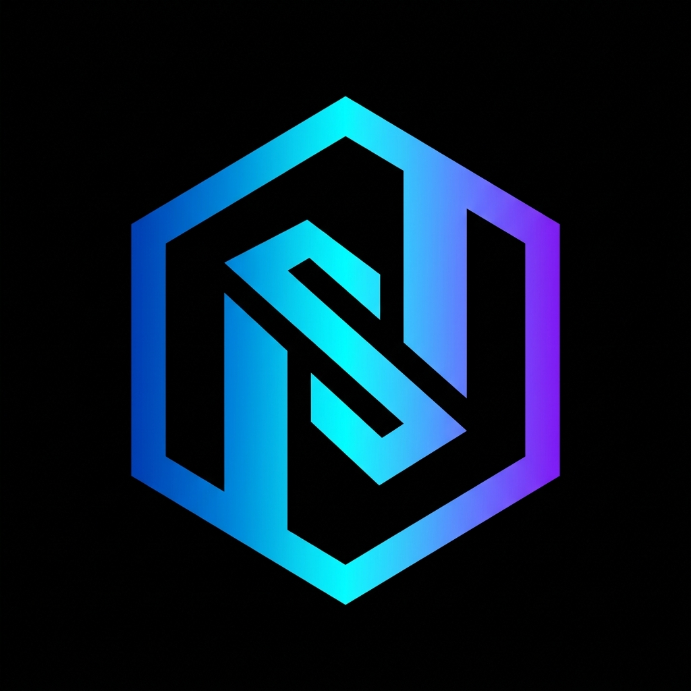

# 🚀 NovaStack

<p align="center">
  
</p>

<p align="center">
  <b>Opinionated. Zero Configuration. Production Ready.</b><br>
  Scaffold a complete full-stack application in minutes with one command.
</p>

<p align="center">


</p>

---

## ✨ What is NovaStack?

NovaStack is an **opinionated full-stack application generator** that eliminates setup fatigue.

Instead of spending hours configuring authentication, databases, Docker, TypeScript, Tailwind, Prisma, and project structure...

Run **one command**.

NovaStack creates a production-ready codebase following modern best practices so you can focus on building your product—not your boilerplate.

---

## 🌐 Website

**Live:** https://nova-stack-seven.vercel.app/

---

# ⚡ Quick Start

No installation required.

```bash
npx @novastack/cli create my-app
```

Or install globally.

```bash
npm install -g @novastack/cli

novastack create my-app
```

That's it.

---

# 🏆 The Golden Stack

Every generated project comes preconfigured with an industry-standard stack.

| Technology           | Purpose                        |
| -------------------- | ------------------------------ |
| ⚡ Next.js 15         | App Router + Server Components |
| 🔷 TypeScript        | Strict Mode                    |
| 🎨 Tailwind CSS v4   | Modern Styling                 |
| 🧩 shadcn/ui         | Beautiful UI Components        |
| 🔐 Better Auth       | Authentication                 |
| 🗄 PostgreSQL        | Database                       |
| 🔥 Prisma ORM        | Type-safe Database Access      |
| 🐳 Docker            | Development & Production       |
| 🛠 ESLint + Prettier | Code Quality                   |

Everything works together out of the box.

---

# 🚀 Features

✅ Zero Configuration

✅ Production Ready

✅ Authentication Included

✅ PostgreSQL + Prisma

✅ Docker Ready

✅ Type Safe

✅ Tailwind CSS v4

✅ shadcn/ui Integrated

✅ Git Initialized Automatically

✅ Auto Dependency Installation

✅ Modern Folder Structure

✅ Best Practices by Default

---

# 📦 What Happens After Running the CLI?

```text
✔ Welcome Banner

✔ Project Creation

✔ Stack Confirmation

✔ File Generation

✔ Dependency Installation

✔ Git Initialization

✔ Initial Commit

✔ Ready to Code 🚀
```

No manual setup.

No copy-pasting templates.

No configuration headaches.

---

# 🚀 Run Your New Project

```bash
# Enter project

cd my-app

# Configure environment

cp .env.example .env.local

# Start PostgreSQL

docker compose up -d

# Push database schema

npx prisma db push

# Start development server

npm run dev
```

Open

```
http://localhost:3000
```

and start building.

---

# 📚 Documentation

| Guide              | Description                 |
| ------------------ | --------------------------- |
| INSTALLATION.md    | Installation & Requirements |
| SUPPORTED_STACK.md | Complete Tech Stack         |
| ROADMAP.md         | Upcoming Features           |
| CONTRIBUTING.md    | Contribution Guide          |
| SECURITY.md        | Security Policy             |
| CHANGELOG.md       | Release History             |
| CODE_OF_CONDUCT.md | Community Guidelines        |

---

# 💡 Why NovaStack?

Most starters give you files.

NovaStack gives you a **production foundation.**

Instead of deciding between dozens of packages, architectures, and configurations, NovaStack ships with carefully selected technologies that work seamlessly together.

Spend your time shipping features instead of configuring tools.

---

# 🛣 Roadmap

* AI Project Generator
* Multiple Database Providers
* SaaS Starter Templates
* Stripe Integration
* Email Providers
* Background Jobs
* CLI Plugins
* Deployment Presets
* More Authentication Providers
* Testing Templates

---

# 🤝 Contributing

Contributions are welcome.

Feel free to open Issues, submit Pull Requests, or suggest new features.

If you like NovaStack, consider giving the repository a ⭐.

---

# 📄 License

Distributed under the **MIT License**.

See the **LICENSE** file for more information.

---

<p align="center">

Built with ❤️ by **Hrithik Burnwal**

</p>
