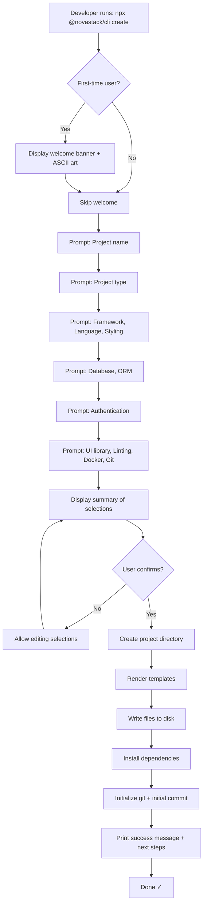
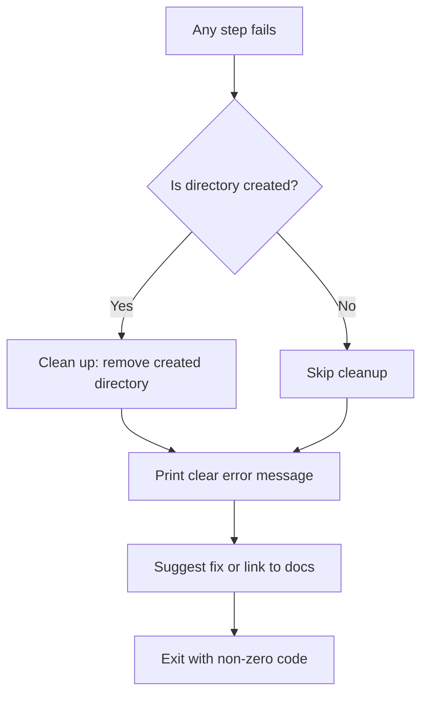
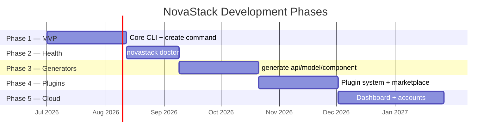

# NovaStack — Product Requirements Document (PRD)

> **Version:** 1.0  
> **Status:** Draft  
> **Last Updated:** July 4, 2026  
> **Author:** NovaStack Core Team

---

## Table of Contents

1. [Product Overview](#1-product-overview)
2. [Problem Statement](#2-problem-statement)
3. [Target Users](#3-target-users)
4. [Product Principles](#4-product-principles)
5. [Scope Definition](#5-scope-definition)
6. [MVP Requirements (Phase 1)](#6-mvp-requirements-phase-1)
7. [User Experience Flow](#7-user-experience-flow)
8. [Non-Functional Requirements](#8-non-functional-requirements)
9. [What NovaStack Is NOT](#9-what-novastack-is-not)
10. [Phased Roadmap Summary](#10-phased-roadmap-summary)
11. [Constraints & Assumptions](#11-constraints--assumptions)
12. [Risks & Mitigations](#12-risks--mitigations)
13. [Success Metrics](#13-success-metrics)
14. [Open Questions](#14-open-questions)
15. [Glossary](#15-glossary)

---

## 1. Product Overview

**NovaStack** is an open-source, framework-agnostic CLI toolkit that helps developers scaffold, analyze, and maintain production-ready full-stack applications.

It unifies the fragmented setup experience — authentication, databases, linting, Docker, environment variables, folder structures, deployment — into a single, opinionated-but-configurable developer tool.

### 1.1 One-Liner

> The CLI that turns "how do I start my project?" into "it's already done."

### 1.2 Product Category

**Developer Experience (DX) Tool** — a CLI installed via npm/npx that developers use locally. NovaStack is **not** a web application, SaaS platform, or hosting service (though a cloud dashboard is planned for Phase 5).

### 1.3 Distribution

| Channel       | Details                                  |
|---------------|------------------------------------------|
| **npm**       | `npx @novastack/cli create` / `npm i -g @novastack/cli` |
| **GitHub**    | Open-source repository, MIT License      |
| **Docs Site** | Dedicated documentation website          |

---

## 2. Problem Statement

### 2.1 The Pain

Starting a modern full-stack application in 2026 requires orchestrating **10+ tools** before writing a single line of business logic:

| Step | Tool/Config | Avg. Time |
|------|-------------|-----------|
| Framework setup | Next.js / Vite | 5 min |
| TypeScript config | `tsconfig.json` | 10 min |
| Styling | Tailwind CSS / CSS Modules | 10 min |
| Database ORM | Prisma / Drizzle | 15 min |
| Database connection | PostgreSQL / MySQL | 10 min |
| Authentication | NextAuth / Clerk / Lucia | 20 min |
| Linting | ESLint + config | 10 min |
| Formatting | Prettier + config | 5 min |
| Containerization | Dockerfile + docker-compose | 15 min |
| Folder structure | Manual organization | 10 min |
| Environment variables | `.env` + validation | 5 min |
| README & docs | Manual writing | 10 min |
| **Total** | | **~2 hours** |

> [!WARNING]
> This doesn't include the time spent debugging configuration conflicts, reading outdated blog posts, or reconciling version mismatches between tools.

### 2.2 The Gap

Existing tools solve **individual** pieces:

| Tool | What It Does | What It Doesn't Do |
|------|-------------|-------------------|
| `create-next-app` | Scaffolds Next.js | No auth, no DB, no Docker |
| `create-vite` | Scaffolds Vite | No backend, no DB, no auth |
| `shadcn/ui` CLI | Adds UI components | No project structure |
| `prisma init` | Initializes Prisma | No connection setup, no models |
| ESLint | Linting | No project awareness |

**No single tool provides the complete picture.** Developers are left stitching together a Frankenstein of configs.

### 2.3 The Opportunity

A unified CLI that:

1. **Scaffolds** a complete, production-ready project in under 2 minutes
2. **Analyzes** project health and reports issues
3. **Generates** boilerplate code (APIs, models, components)
4. **Extends** via a plugin system
5. **Evolves** with the developer's needs over time

---

## 3. Target Users

### 3.1 Primary Personas

#### Persona A — The Student Developer

| Attribute | Detail |
|-----------|--------|
| **Experience** | 6–18 months of coding |
| **Pain** | Overwhelmed by configuration; copies boilerplate from tutorials |
| **Need** | A single command that "just works" with best practices baked in |
| **Trigger** | Starting a class project, hackathon, or portfolio piece |
| **Quote** | *"I want to build features, not spend 2 hours setting up TypeScript and Prisma."* |

#### Persona B — The Freelance Developer

| Attribute | Detail |
|-----------|--------|
| **Experience** | 2–5 years |
| **Pain** | Repetitive project setup across clients; inconsistent configurations |
| **Need** | Standardized, customizable templates that produce professional output |
| **Trigger** | Starting a new client project every 2–4 weeks |
| **Quote** | *"I've set up Next.js + Prisma + auth 30 times. I need this automated."* |

#### Persona C — The Startup Founder / Tech Lead

| Attribute | Detail |
|-----------|--------|
| **Experience** | 5+ years |
| **Pain** | Onboarding new devs to inconsistent project structures; maintaining standards |
| **Need** | Team-wide standardization; project health monitoring; code generation |
| **Trigger** | Scaling from 1 to 5+ developers |
| **Quote** | *"Every new hire sets things up differently. We need a standard."* |

### 3.2 Secondary Personas

| Persona | Use Case |
|---------|----------|
| **Open-source contributor** | Uses NovaStack to scaffold new OSS projects with proper structure |
| **Educator / Bootcamp instructor** | Provides students a consistent starting point |
| **Internal tooling team** | Builds company-specific templates on top of NovaStack |

---

## 4. Product Principles

These principles guide every design and implementation decision:

### P1 — Zero-to-Production in Minutes

> The critical path from `npx @novastack/cli create` to a deployable application must take **under 2 minutes** on a standard machine.

### P2 — Opinionated Defaults, Escape Hatches Everywhere

> NovaStack ships with strong defaults (the "golden path"), but every choice is overridable. No lock-in.

### P3 — The Output is Yours

> Generated code belongs to the developer. No hidden runtime dependencies. No vendor coupling. Eject at any time with zero consequences.

### P4 — Composable, Not Monolithic

> Each feature (auth, DB, Docker, linting) is an independent module. Developers pick what they need. Nothing is mandatory except the core scaffold.

### P5 — Explain, Don't Hide

> Every generated file includes comments explaining **why** it exists and **what** it does. NovaStack is an educational tool as much as a productivity tool.

### P6 — Offline-First

> Core functionality works without an internet connection (except for initial npm install and package downloads). No account required. No telemetry by default.

### P7 — Progressive Complexity

> Simple projects should feel simple. Complex projects should be possible. The tool grows with the developer.

---

## 5. Scope Definition

### 5.1 What NovaStack Does

| Capability | Phase | Description |
|------------|-------|-------------|
| **Project scaffolding** | 1 (MVP) | Interactive CLI that generates a fully configured full-stack project |
| **Health checking** | 2 | Analyzes existing projects for missing configs, vulnerabilities, outdated deps |
| **Code generation** | 3 | Generates APIs, models, components, and pages from templates |
| **Plugin system** | 4 | Third-party extensions that add custom generators, templates, or commands |
| **Cloud dashboard** | 5 | User accounts, template sharing, analytics, plugin marketplace |

### 5.2 What NovaStack Does NOT Do

> [!IMPORTANT]
> These boundaries are critical to maintaining product focus.

| It Is NOT | Explanation |
|-----------|-------------|
| A web framework | It **generates** code for frameworks (Next.js, etc.), but is not a framework itself |
| A hosting platform | It does not deploy, host, or manage infrastructure |
| A runtime dependency | Generated projects have **zero** NovaStack runtime dependencies |
| A UI library | It can install UI libraries (shadcn/ui, etc.), but is not one |
| An IDE or editor | It is a CLI tool, not an editor extension (though editor plugins may come later) |
| A package manager | It uses npm/pnpm/yarn but does not replace them |
| A CI/CD platform | It generates CI/CD configs but does not execute pipelines |

---

## 6. MVP Requirements (Phase 1)

> [!NOTE]
> Phase 1 delivers the `novastack create` command. This is the **minimum viable product** that must ship before any other feature.

### 6.1 Command: `novastack create`

#### 6.1.1 Invocation

```bash
# Interactive mode (recommended)
npx @novastack/cli create

# With project name
npx @novastack/cli create my-app

# Non-interactive mode (CI/CD friendly)
npx @novastack/cli create my-app --template fullstack --db postgres --auth nextauth --yes
```

#### 6.1.2 Zero-Choice Philosophy

> [!IMPORTANT]
> The MVP ships with **one opinionated stack**. No choices. No configuration paralysis.
> The only question is: *"What's your project name?"*

**The Golden Stack (MVP):**

| Layer | Technology | Why |
|-------|-----------|-----|
| Framework | **Next.js 15** | Dominant full-stack React framework |
| Language | **TypeScript** | Industry standard for production apps |
| Styling | **Tailwind CSS v4** | Utility-first, zero-config in v4 |
| Database | **PostgreSQL** | Battle-tested, scalable, free |
| ORM | **Prisma** | Best DX, type-safe, visual studio |
| Auth | **Better Auth** | Modern, framework-agnostic, self-hosted |
| UI | **shadcn/ui** | Copy-paste components, full ownership |
| Linting | **ESLint + Prettier** | Non-negotiable for production code |
| Container | **Docker** | Reproducible environments |

**Interactive Prompts (MVP):**

| # | Prompt | Type | Default |
|---|--------|------|---------|
| 1 | Project name | Text input | `my-novastack-app` |
| 2 | Package manager | Auto-detect | Detected from lockfiles |

Future versions (v1.5+) will introduce choices: Drizzle, SQLite, Vue, React standalone, etc.

#### 6.1.3 Generated Output

For a **fullstack** project with all defaults, the generated structure should look like:

```
my-novastack-app/
├── .env.example              # Environment variable template
├── .env.local                # Local env (gitignored)
├── .eslintrc.json            # ESLint configuration
├── .gitignore                # Comprehensive gitignore
├── .prettierrc               # Prettier configuration
├── Dockerfile                # Multi-stage production Dockerfile
├── docker-compose.yml        # Dev environment with DB
├── next.config.ts            # Next.js configuration
├── package.json              # Dependencies & scripts
├── prisma/
│   ├── schema.prisma         # Database schema with User model
│   └── seed.ts               # Database seeder
├── public/
│   └── ...                   # Static assets
├── README.md                 # Generated documentation
├── src/
│   ├── app/                  # Next.js App Router
│   │   ├── layout.tsx        # Root layout with providers
│   │   ├── page.tsx          # Landing page
│   │   ├── api/
│   │   │   ├── auth/
│   │   │   │   └── [...all]/
│   │   │   │       └── route.ts  # Better Auth catch-all
│   │   │   └── health/
│   │   │       └── route.ts  # Health check endpoint
│   │   └── (dashboard)/
│   │       └── page.tsx      # Protected dashboard page
│   ├── components/
│   │   ├── ui/               # shadcn/ui components
│   │   └── layout/           # Layout components
│   ├── lib/
│   │   ├── auth.ts           # Better Auth server instance
│   │   ├── auth-client.ts    # Better Auth client
│   │   ├── db.ts             # Prisma client singleton
│   │   └── utils.ts          # Utility functions (cn helper)
│   ├── styles/
│   │   └── globals.css       # Global styles + Tailwind
│   └── types/
│       └── index.ts          # Shared type definitions
├── tailwind.config.ts        # Tailwind configuration
└── tsconfig.json             # TypeScript configuration
```

#### 6.1.4 Functional Requirements

| ID | Requirement | Priority | Description |
|----|-------------|----------|-------------|
| FR-01 | Interactive prompts | **Must** | CLI presents configurable prompts with sensible defaults |
| FR-02 | Non-interactive mode | **Must** | Support `--yes` flag and CLI arguments for CI/CD |
| FR-03 | Project scaffolding | **Must** | Generate complete project structure based on user selections |
| FR-04 | Dependency installation | **Must** | Install correct dependencies via detected/selected package manager |
| FR-05 | Git initialization | **Should** | Initialize git repo with initial commit |
| FR-06 | Template rendering | **Must** | Generate files using a template engine with variable substitution |
| FR-07 | Conflict detection | **Must** | Detect and warn if target directory is non-empty |
| FR-08 | Post-scaffold instructions | **Must** | Print clear next-steps after generation |
| FR-09 | Error recovery | **Must** | Clean up partial output on failure (rollback) |
| FR-10 | Progress indication | **Should** | Show spinner/progress bar during generation |
| FR-11 | Dry-run mode | **Could** | `--dry-run` flag to preview what would be generated |
| FR-12 | Config file support | **Could** | Read defaults from `novastack.config.json` |

#### 6.1.5 Generated Code Quality Requirements

| ID | Requirement | Description |
|----|-------------|-------------|
| GC-01 | **Runnable out of the box** | `npm run dev` must work immediately after generation |
| GC-02 | **Zero warnings** | Generated code must have zero ESLint/TypeScript warnings |
| GC-03 | **Commented code** | Every non-trivial file includes explanatory comments |
| GC-04 | **Proper .env handling** | `.env.example` with all vars documented; `.env.local` gitignored |
| GC-05 | **Security defaults** | CORS headers, rate limiting awareness, env validation |
| GC-06 | **Production Dockerfile** | Multi-stage build, non-root user, optimized layers |
| GC-07 | **Working auth flow** | If auth selected: login, logout, session, protected routes |
| GC-08 | **Database connection** | If DB selected: working connection, health check, seeder |
| GC-09 | **README generation** | Auto-generated README with project name, setup steps, tech stack |

### 6.2 Command: `novastack --version`

Print the current CLI version.

### 6.3 Command: `novastack --help`

Print usage information for all available commands and global options.

---

## 7. User Experience Flow

### 7.1 Happy Path — `novastack create`



### 7.2 Error Path



### 7.3 CLI Output Design

The CLI output should be **beautiful and informative**:

```
  ╔══════════════════════════════════════╗
  ║                                      ║
  ║   ◆  N O V A S T A C K              ║
  ║      Build fast. Ship faster.        ║
  ║                                      ║
  ╚══════════════════════════════════════╝

  ✔ Project name: my-saas-app
  ✔ Type: fullstack
  ✔ Framework: Next.js 15
  ✔ Language: TypeScript
  ✔ Styling: Tailwind CSS
  ✔ Database: PostgreSQL + Prisma
  ✔ Auth: NextAuth.js
  ✔ UI: shadcn/ui
  ✔ Linting: ESLint + Prettier
  ✔ Docker: Yes
  ✔ Git: Yes

  ⏳ Creating project...

  ├── Rendering templates        ✓ (0.4s)
  ├── Writing 47 files           ✓ (0.2s)
  ├── Installing dependencies    ✓ (12.3s)
  ├── Initializing git           ✓ (0.1s)
  └── Running initial lint       ✓ (1.8s)

  ✅ Project created successfully!

  Next steps:
    cd my-saas-app
    cp .env.example .env.local    # Configure environment
    docker compose up -d          # Start database
    npx prisma db push            # Sync schema
    npm run dev                   # Start development

  📖 Docs: https://novastack.dev/docs
  ⭐ Star us: https://github.com/novastack/novastack
```

---

## 8. Non-Functional Requirements

### 8.1 Performance

| Metric | Target | Measurement |
|--------|--------|-------------|
| Scaffold time (excl. install) | < 5 seconds | Time from confirmation to files written |
| Total time (incl. install) | < 60 seconds | On a 50 Mbps connection |
| CLI startup time | < 500ms | Time from invocation to first prompt |
| Memory usage | < 200 MB | Peak during generation |

### 8.2 Compatibility

| Dimension | Requirement |
|-----------|-------------|
| **Node.js** | ≥ 18.0.0 (LTS) |
| **npm** | ≥ 9.0.0 |
| **OS** | macOS, Linux, Windows (WSL and native PowerShell) |
| **Terminal** | Standard terminals, iTerm2, Windows Terminal, VS Code integrated terminal |
| **CI/CD** | GitHub Actions, GitLab CI, Jenkins (via non-interactive mode) |

### 8.3 Reliability

| Requirement | Description |
|-------------|-------------|
| **Atomic operations** | Generation is all-or-nothing; failures trigger rollback |
| **Graceful degradation** | Network failures during install show clear message; generated files remain valid |
| **Idempotency** | Running `create` twice in the same directory prompts for overwrite confirmation |
| **Signal handling** | SIGINT (Ctrl+C) triggers cleanup before exit |

### 8.4 Security

| Requirement | Description |
|-------------|-------------|
| **No telemetry** | No data collection without explicit opt-in |
| **No network calls** | Core scaffolding works offline (post npm install) |
| **Dependency auditing** | Generated `package.json` uses latest stable, audited versions |
| **Secret handling** | No secrets in generated code; `.env.local` is always gitignored |

### 8.5 Accessibility

| Requirement | Description |
|-------------|-------------|
| **Color-blind safe** | Use symbols (✓, ✗, ⚠) alongside colors |
| **No-color mode** | Respect `NO_COLOR` environment variable |
| **Screen reader friendly** | Clean text output without excessive decorators |

### 8.6 Extensibility

| Requirement | Description |
|-------------|-------------|
| **Template modularity** | Each feature (auth, DB, Docker) is a standalone template module |
| **Config-driven** | Template composition is driven by a declarative config, not hardcoded logic |
| **Plugin-ready architecture** | MVP codebase is structured to support Phase 4 plugin system |

---

## 9. What NovaStack Is NOT

To prevent scope creep, the following are **explicitly out of scope**:

| Excluded Feature | Rationale |
|-----------------|-----------|
| Runtime library | Generated code must run independently of NovaStack |
| Hosting / deployment execution | We generate configs, not run deploys |
| Online editor | NovaStack is a CLI, not a web IDE |
| Code review / PR analysis | Out of scope; belongs in dedicated tools |
| AI code generation | Planned for future phases, not MVP |
| Mobile app scaffolding | Focus is web (full-stack) applications |
| Monorepo management | Single-project scaffolding for MVP |
| GUI / Desktop app | CLI-only for MVP; GUI wrappers may come from community |

---

## 10. Phased Roadmap Summary

> [!NOTE]
> Detailed timelines and milestones will be defined in the **Roadmap & Milestones** document. This is a high-level overview.



| Phase | Deliverable | Key Command(s) |
|-------|-------------|-----------------|
| **1 — MVP** | Core CLI with project scaffolding | `novastack create` |
| **2 — Health** | Project health analysis | `novastack doctor` |
| **3 — Generators** | Code generation for APIs, models, components, pages | `novastack generate <type>` |
| **4 — Plugins** | Third-party extension system | `novastack plugin install <name>` |
| **5 — Cloud** | User accounts, template syncing, analytics, marketplace | `novastack login`, web dashboard |

---

## 11. Constraints & Assumptions

### 11.1 Constraints

| Constraint | Impact |
|------------|--------|
| Open-source (MIT License) | All code is public; no proprietary dependencies |
| npm as primary distribution | Must follow npm publishing best practices |
| Node.js runtime | CLI runs on Node.js; no native binaries for MVP |
| Single-developer start | Architecture must be maintainable by a small team |

### 11.2 Assumptions

| Assumption | Risk if Wrong |
|------------|---------------|
| Developers want opinionated defaults | Users may reject our choices → mitigate with escape hatches |
| Next.js is the dominant framework for full-stack | React ecosystem shifts → mitigate with framework-agnostic template layer |
| TypeScript is preferred over JavaScript | Some communities prefer JS → mitigate by supporting both |
| npm/npx is the primary install method | Bun/Deno growth → mitigate with package-manager-agnostic design |

---

## 12. Risks & Mitigations

| Risk | Severity | Likelihood | Mitigation |
|------|----------|------------|------------|
| Template maintenance burden (keeping up with framework updates) | High | High | Automated CI testing of generated projects; version-pinned templates |
| Feature creep before MVP ships | High | Medium | Strict phase gating; this PRD as the contract |
| Generated code has bugs / doesn't compile | High | Medium | End-to-end tests that scaffold + build + lint every template combination |
| Low adoption | Medium | Medium | Focus on documentation, DevRel, and real developer pain points |
| Competition from AI code generators | Medium | Medium | Position as complementary: NovaStack provides structure, AI fills in logic |
| Dependency vulnerabilities in generated code | High | Low | Automated dependency audit in CI; Dependabot-style alerts |

---

## 13. Success Metrics

### 13.1 Launch Metrics (First 90 Days)

| Metric | Target |
|--------|--------|
| npm weekly downloads | > 500 |
| GitHub stars | > 200 |
| Open issues resolved rate | > 80% |
| Generated project "first build" success rate | > 95% |
| Documentation coverage | 100% of commands documented |

### 13.2 Growth Metrics (6 Months)

| Metric | Target |
|--------|--------|
| npm weekly downloads | > 5,000 |
| GitHub stars | > 1,000 |
| Community plugins | > 5 |
| Framework support | ≥ 2 (Next.js + one more) |
| Contributors | > 10 |

### 13.3 North Star Metric

> **Time from `npx @novastack/cli create` to `npm run dev` showing a working application.**
>
> Target: **under 60 seconds** (on a reasonable connection).

---

## 14. Open Questions

> [!TIP]
> These questions should be resolved before or during Phase 1 implementation.

| # | Question | Impact | Status |
|---|----------|--------|--------|
| 1 | Should MVP support multiple frameworks or Next.js only? | Scope | **Proposed: Next.js only for MVP** |
| 2 | Should we support monorepo templates (e.g., Turborepo)? | Architecture | **Proposed: No, single-project only for MVP** |
| 3 | What template engine should we use? (Handlebars, EJS, custom) | Implementation | Open |
| 4 | Should generated projects include testing setup (Jest/Vitest)? | Scope | **Proposed: Yes, as an optional prompt** |
| 5 | Should we support Drizzle ORM from MVP or Prisma only? | Scope | **Proposed: Both as options** |
| 6 | How do we handle template versioning when frameworks release breaking changes? | Maintenance | Open |
| 7 | Should the CLI check for updates on each run? | UX | **Proposed: Yes, non-blocking notification** |
| 8 | What is our minimum supported Next.js version? | Compatibility | **Proposed: Latest stable (15.x)** |

---

## 15. Glossary

| Term | Definition |
|------|-----------|
| **CLI** | Command-Line Interface — a text-based interface for running commands |
| **Scaffold** | The process of generating a project's initial file structure and configuration |
| **Template** | A pre-defined file or set of files with placeholder variables that get replaced during scaffolding |
| **Golden path** | The recommended, opinionated set of defaults that produce the best outcome for most users |
| **DX** | Developer Experience — how pleasant and productive a tool is for developers to use |
| **ORM** | Object-Relational Mapping — a library that lets you interact with databases using programming language constructs |
| **Escape hatch** | A way to override or opt out of an opinionated default |
| **Plugin** | A third-party extension that adds functionality to NovaStack |
| **Rollback** | The process of undoing partial changes when an operation fails |
| **Idempotent** | An operation that produces the same result regardless of how many times it's executed |

---

> **Document Status:** This PRD is a living document. It will be updated as decisions are made and the product evolves. All changes should be versioned and reviewed by the core team.
